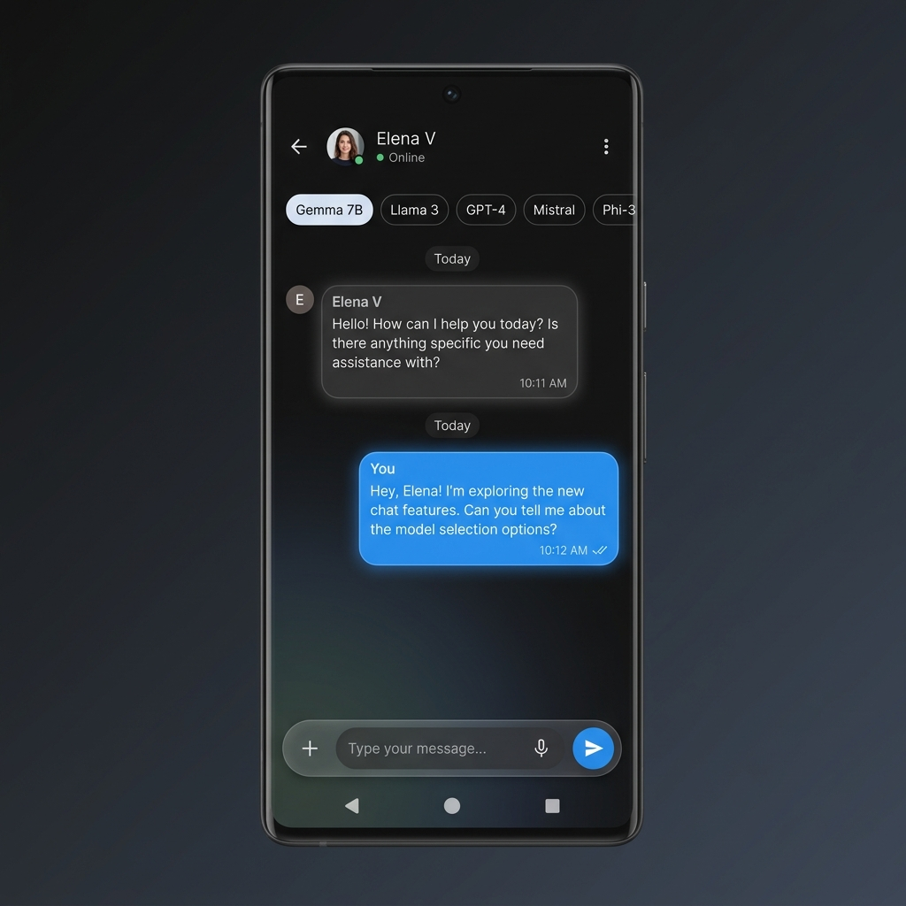

# GemmaLocal AI (Android)

A modern, minimalistic, and 100% offline AI chat application for Android. Built with Flutter and designed to run Google's Gemma models (and other GGUF models) directly on your device.

## Features
- **Offline Inference**: No internet required, no data leaves your device.
- **Modern UI**: Material 3 design with dynamic colors and smooth animations.
- **Model Flexibility**: Support for Gemma 2B, Llama 3, and more.
- **Privacy First**: Total privacy by design.

## UI Preview


## Getting Started
1. **Prerequisites**:
   - Flutter SDK
   - Android Studio / Android SDK
2. **Installation**:
   ```bash
   git clone <repo-url>
   cd gemma_local
   flutter pub get
   ```
3. **Download a Model**:
   - Download a Gemma 2B GGUF model (e.g., from Hugging Face).
   - Place it in your phone's internal storage.
4. **Run**:
   ```bash
   flutter run
   ```

## Tech Stack
- **Frontend**: Flutter (Material 3)
- **State Management**: Riverpod
- **Inference Engine**: `llama.cpp` or `MediaPipe GenAI` (Android Native)
